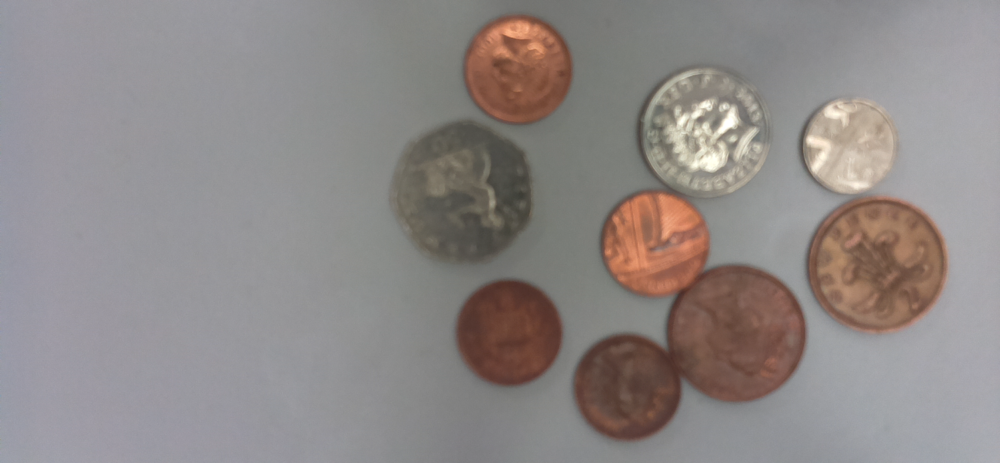

# Computer Vision Capstone (Python + OpenCV)



A professional **Computer Vision capstone project** built with **Python** and **OpenCV** to detect coins in an image, classify denominations, and estimate total monetary value.

---

## Project Summary

This project performs end-to-end coin analysis from a static image:

- Detects circular coin boundaries using **Hough Circle Transform**
- Extracts key visual features:
  - **Radius**
  - **Local brightness (pixel intensity)**
- Classifies each detected coin into denominations (`1p`, `2p`, `5p`, `10p`) using rule-based thresholds
- Annotates the output image with individual values and total estimated value

The implementation demonstrates a complete computer vision workflow:  
**image preprocessing → object detection → feature extraction → classification → visualization**.

---

## Repository Structure

```text
computer-vision-capstone-python/
│
├── assets/
│   └── capstone_coins.png
│
├── capstone_solution.py
├── requirements.txt
├── opencv_install.md
├── .gitignore
└── README.md
```

---

## Technologies Used

- **Python 3**
- **OpenCV**
- **NumPy**

---

## Methodology

### 1) Image Preprocessing
- Load the image in grayscale
- Apply Gaussian blur to reduce noise and improve circle detection stability

### 2) Coin Detection
- Use `cv2.HoughCircles()` to detect circular objects (coins)
- Tune `minRadius`, `maxRadius`, and threshold parameters for better detection quality

### 3) Feature Extraction
For each detected coin:
- Radius is extracted from circle geometry
- Average local intensity is computed from pixel values around the center

### 4) Coin Classification
A rule-based classifier maps (`brightness`, `radius`) to denomination:
- `10p`, `5p`, `2p`, `1p`

### 5) Visualization & Reporting
- Draw coin boundaries and centers
- Overlay denomination labels near each coin
- Compute and display total estimated value

---

## How to Run

### Option A — Conda (Recommended)
Follow setup steps in [`opencv_install.md`](opencv_install.md), then run:

```bash
python capstone_solution.py
```

### Option B — pip

```bash
pip install -r requirements.txt
python capstone_solution.py
```

---

## Output

The script produces:

- **Terminal output**
  - Detected circles
  - Radius values
  - Brightness values
  - Predicted denominations
  - Total estimated value
- **OpenCV output window**
  - Coin outlines
  - Coin labels (`1p`, `2p`, `5p`, `10p`)
  - Final total value annotation

---

## Notes

- This project uses an interpretable threshold-based approach suitable for capstone learning outcomes.
- For higher robustness, thresholds may need retuning under different lighting conditions and image resolutions.

---

## Future Improvements

- Support additional currencies and coin sets
- Add CSV/JSON output export
- Build a simple Streamlit or Flask interface
- Add test coverage and configurable detection parameters

---

## Author

**Tushar Varma**  
GitHub: [@TusharVarma1322](https://github.com/TusharVarma1322)
